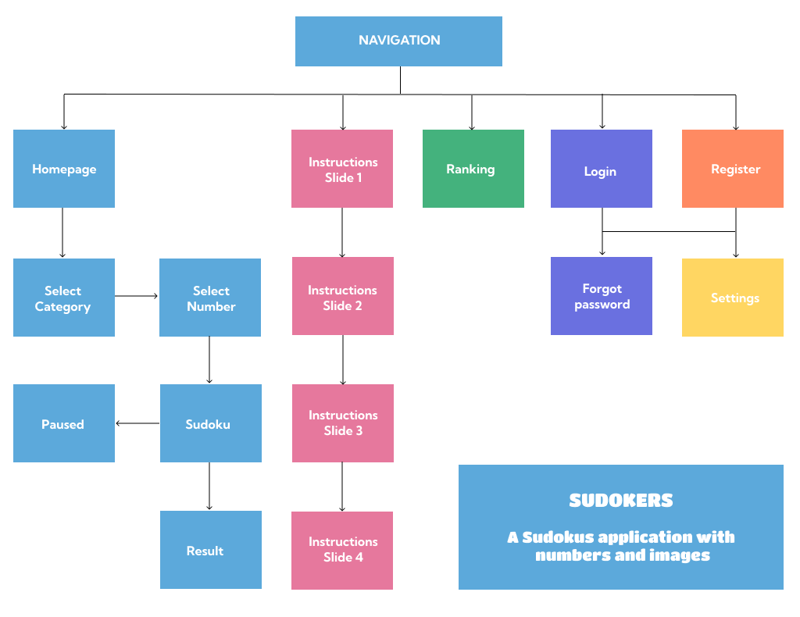

# FINAL PROJECT
## Overview

This is a sudoku game app.

You can play traditional sudoku (with numbers), or with images ordered by categories, which makes it visually attractive and adds difficulty and interest.

There is the possibility of registering, which allows you to be part of the Ranking (if you manage to be among the three best times in the category and number of sudoku).

The application is made up of six pages and various subpages.

- **Homepage**, to play sudokus. It has as subpages, Game paused, Select category and sudoku number, and Result.

- **Instructions**, it is a carousel, which explains the mechanics of the game.

- **Ranking**, where you can view the three best results based on the time spent, selected by category and number.

- **Login**, which has a password recovery subpage.

- **Register**, where you can register as a new user.

- And **Settings** that incorporates two functions, changing the password or unsubscribing as a user.
Obviously this page is only visible once logged in.

## Requirements

The app has been created using **React** for the _FRONTEND_. 

I have used **HTML** for the structure, **CSS** and **SASS** preprocessor for the styles, **Javascript** for programming algorithms, **JSON** format for data exchange, as well as **Axios** for handling the **CRUD API** functionality.

The _BACKEND_ programming language is **Python** and the database is programmed in **MySQL**.

I have used the **Flask** framework to create the API for communication with the database and the frontend.

Both the backend and the frontend are developed using **Functional Programming** and **Object-Oriented Programming**.

To manage the project I have followed the guidelines of the **Waterfall methodology**.

I have used **UML** to **solve problems** (database and functionalities).

Regarding the **quality of the code**, I use descriptive names, I avoid code repetition and I include comments, where it is necessary to explain the code.

**Git** is the tool used for version control.

I have incorporated several features not learned in the course, such as **Flask-Login**, for authentication and management of user sessions, **SendGridAPIClient** for sending emails, in the case of lost password and a React carousel library, **nuka-carousel**.

## Requirements Summary

### Languages and technologies
- HTML
- CSS/SASS
- Javascript
- REACT
- Python
- MySQL
- Axios
- JSON
- UML
- Git/GitHub

### Methodologies/Best Practices
- Control structures
- Functional programming
- Object-oriented programming
- Algorithms
- RESTful API
- Project management
- Code quality
- Problem resolution

## Project development

### Why?

I have decided to make a sudoku application, because it adapts perfectly to the requirements established for the final project, but above all, because I love sudokus and it occurred to me to do something different like using images in addition to the traditional numbers.

### Main goal

The main objective of this application is to offer a space for fun and entertainment where stress and worries do not exist.

Sudokus have been with us for a long time, they are entertaining, universal and inclusive.

This application offers an attractive visual experience by including not only numbers, but also images. This characteristic makes it unique.

### User stories

Basically three types of user are considered: John, Jane and Jim.

_John_

I like traditional sudoku puzzles, to have a good time and enjoy solving them.

_Jane_

I love sudoku, I am competitive, I enjoy challenges, I want it to go on record.

_Jim_

I like games and especially those that surprise me, both for their innovation and their playability.

### Site Map

>  

### Wireframes

#### Smartphone

> 
> 
> 
> 
> 
> 

#### Desktop

> 
> 
> 
> 
> 
> 

### Style guide

> 

### Problem resolution

#### User

> 

#### Database

> 

#### Sudoku

> 

#### Ranking

> 

### Tests

They are carried out with the collaboration of family and friends, and consist of using the application and all its features and communicating any errors detected.

And above all with the use of `console.log()`, and the tools of the **Firefox** and **Chrome** browsers.

### Deployment

Deployment is done through a free account at https://www.pythonanywhere.com/

The location of the application is https://sudokers.eu.pythonanywhere.com/